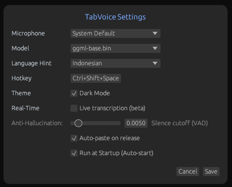

# TabVoice

Leave behind the fatigue of manual typing. **TabVoice** is an AI-powered voice typing assistant that is smoother, faster, and runs 100% locally on your device. Simply hold a single hotkey from any application, speak naturally, and watch your words typed out with incredible accuracy in seconds—no cloud subscriptions, no privacy compromises, and no annoying delays.

Built in **Rust** for ultra-lightweight, zero-bloat performance and powered by the Whisper AI model (with GPU acceleration support), TabVoice is designed to multiply your productivity when replying to emails, writing long documents, or capturing instant ideas.

### Video Showcase




*A minimalist interface, always ready to listen to your voice.*

## Key Features

- **Global Push-to-Talk**: Press and hold the configured hotkey from anywhere to start recording.
- **Auto-Paste**: The transcribed text is automatically pasted into your active input field.
- **Self-Contained Model**: The 74MB *Whisper Base* AI model is embedded directly into the executable. No additional downloads or external extractions required! *Plug-and-play*.
- **Professional Branding**: Features a custom icon for the user interface, Windows Taskbar, and macOS/Linux Docks.
- **Minimalist & Modern UI**: A transparent, floating interface that stays out of your way while you work.

## Installation

This application is truly **Plug-and-Play**. You do not need to download model files separately. Just run the executable.

### For Users (Windows)

1. Download `tabvoice.exe`.
2. Run `tabvoice.exe`. You can immediately use the default hotkey to start speaking.

### Build from Source (Cross-Platform)

TabVoice can be built for **Windows, macOS, and Linux**:

```bash
cargo build --release
```

*Note: Make sure your system has a C++ compiler and CMake installed to compile the backend library.*

---

## How to Use

1. **Launch the App:** Open `tabvoice.exe` (or run via `cargo run --release`). 
2. **Select Model & Language:** Upon launch, the main interface will appear. You can also right-click the TabVoice icon in the System Tray, then select **Settings**. Choose your preferred model (e.g., *Base* or *Turbo*) and recognition language (powered by the original Whisper library).
3. **Start Speaking:** Focus on any text editor, chat app, or text field. Hold `Ctrl + Shift + Space` (or your configured hotkey) and start speaking.
4. **Paste Text:** Release the key when you're done. Your speech will be transcribed and automatically typed exactly where your cursor is!

---

## System Requirements

* **OS:** Windows 10/11, macOS, or Linux.
* **Hardware:** NVIDIA GPU (recommended for CUDA acceleration) or Apple Silicon for maximum performance.
* **Build Dependencies (For Developers):**
  * Rust (1.77+)
  * CMake & C++ Build Tools (Visual Studio Build Tools for Windows, Clang for macOS/Linux).

## Architecture & Development

This application is developed in **Rust** using a high-performance (*Low-Latency* & *Zero-Bloat*) architectural approach:

* `egui` & `eframe` — Highly responsive user interface rendering.
* `whisper-cpp` & FFI — Native C-bindings (FFI) to *whisper.cpp* for local inference, ensuring highly efficient memory usage.
* `global-hotkey` — Global Push-to-Talk shortcut detection.
* `cpal` & `rubato` — Real-time microphone audio capture and resampling.
* `reqwest` & `tokio` — Asynchronous (non-blocking) model downloading.
* Cross-Platform Ecosystem — Utilizes native APIs (`windows-rs` for Win32) and cross-platform standard libraries (`enigo` and `tray-icon`) on Linux/macOS.

---
**TabVoice** was created to provide the smoothest dictation experience without compromising your data privacy. Just hold the hotkey, speak, and let the AI do the typing!
